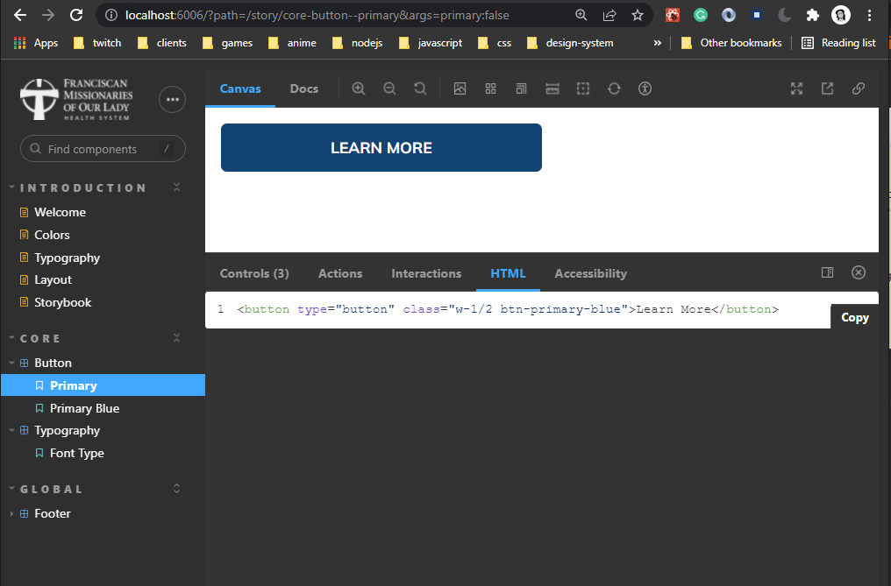

## Getting Started

This project uses:

- Nodejs (`.nvmrc`).
- [Storybook](https://storybook.js.org/docs/react/get-started/introduction) Build component driven UIs faster.
- [Tailwindcss](https://tailwindcss.com/docs/installation) CSS utility framework.
- [Next.js Documentation](https://nextjs.org/docs) - learn about Next.js features and API.

```bash
npm run storybook   # runs storybook developmet server
npm run dev   # runs next.js developmet server
npm run backend:build  # build css and js files to dist folder
```

HTML is generated through a storybook addon, you can see it on bottom addons tab.

<!--  -->


There is an example of how to include Regular Javascript logic into Stories
here: `src/Accordion/Accordion.stories.jsx`;
